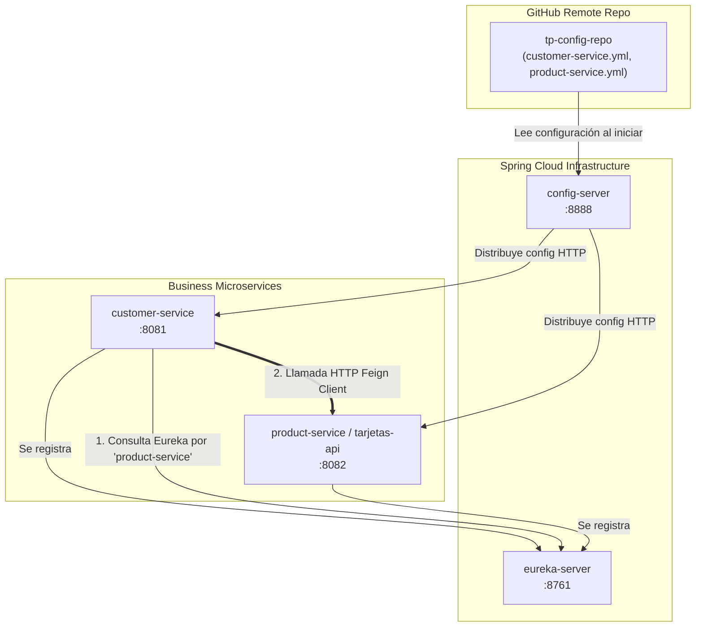
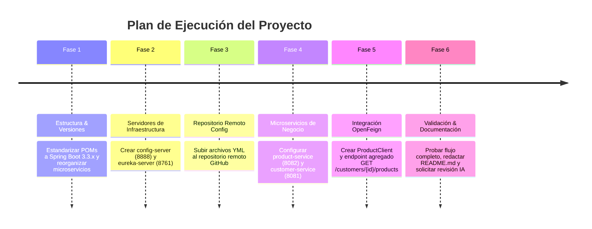

# Informe de Análisis Técnico y de Proyecto — TP Final Diplomatura FinTech

**Para:** Usuario / Equipo de Desarrollo  
**Rol:** Analista Técnico y de Arquitectura de Software  
**Fecha de Análisis:** 30 de Julio de 2026  
**Fecha Límite de Entrega:** 31 de Julio de 2026  

---

## 1. Resumen Ejecutivo

El presente informe expone la evaluación técnica integral del proyecto final para la **Diplomatura en Desarrollo de Software FinTech: IA y Microservicios (UTN BA)**.

A partir del análisis exhaustivo de la documentación oficial (`# Repaso TP Final — Ecosistema de Micros.md` y `Clase 26.pdf`), la solución base provista por el docente (`TarjetasApi-master`), y el repositorio actual del estudiante (`PoryectoDiplomatura`), se determina lo siguiente:

1. **Estado del Repositorio Actual del Estudiante:** Se encuentra en etapa **inicial / esqueleto**. Solo contiene la estructura base generada por Spring Initializr con un archivo `application.yaml` local y un error tipográfico en el nombre del paquete/proyecto (`PoryectoDiplomatura`). **Carece del 90% de la lógica de negocio y de los 4 microservicios requeridos.**
2. **Proyecto Base del Profesor (`TarjetasApi`):** Es una API funcional para gestión de tarjetas y productos bancarios con persistencia en MySQL, pero concebida como servicio independiente sin conexión activa a Eureka ni a Config Server.
3. **Diagnóstico General:** Es necesario construir y desplegar un ecosistema distribuido compuesto por **4 microservicios Spring Boot independientes** (`config-server`, `eureka-server`, `product-service` y `customer-service`) que se integren mediante **OpenFeign**, **Service Discovery (Eureka)** y **Spring Cloud Config Server** con repositorio Git externo.

---

## 2. Respuestas a las 12 Preguntas del Requerimiento

### Q1. ¿Cuál es el objetivo del proyecto según la documentación?
El objetivo es desarrollar un **ecosistema de microservicios distribuido orientado a FinTech/Homebanking**. El sistema debe simular el backend de una entidad financiera donde el servicio de clientes (`customer-service`) agrega la información personal del usuario junto a sus productos financieros (cuentas, préstamos, inversiones) y tarjetas (débito/crédito) gestionadas por un servicio secundario (`product-service`), comunicándose mediante **OpenFeign** y registrándose en **Eureka Server**, con configuración centralizada en **Spring Cloud Config Server**.

### Q2. ¿Qué arquitectura propone el profesor?
Una arquitectura distribuida de microservicios basada en la pila **Spring Cloud**:



### Q3. ¿Qué componentes, microservicios y tecnologías se utilizan?
* **Tecnología Base:** Java 21, Spring Boot 3.x, Apache Maven.
* **Componentes de Spring Cloud:**
  * `spring-cloud-config-server` / `spring-cloud-starter-config`
  * `spring-cloud-starter-netflix-eureka-server` / `spring-cloud-starter-netflix-eureka-client`
  * `spring-cloud-starter-openfeign`
* **Persistencia y Datos:** Spring Data JPA, Base de datos H2 (para entorno rápido/pruebas) o MySQL 8+.
* **Documentación & Mapeo:** Springdoc OpenAPI / Swagger UI (`springdoc-openapi-starter-webmvc-ui`), Lombok, DTOs (Records Java 16+), Mappers explícitos.
* **Microservicios Requeridos:**
  1. `config-server` (Puerto `8888`)
  2. `eureka-server` (Puerto `8761`)
  3. `product-service` (Puerto `8082`)
  4. `customer-service` (Puerto `8081`)

### Q4. ¿Qué funcionalidades ya están implementadas en el proyecto base del profesor?
En `TarjetasApi-master`:
* Controladores REST, Entidades JPA y Repositorios para **Tarjetas** (`/tarjetas`, `/tarjetas/cliente/{clienteId}`) y **Productos** (`/productos`, `/productos/cliente/{clienteId}`).
* Endpoint con Feign Client para consultar cotización del dólar MEP (`DolarClient`).
* Configuración de Swagger UI.
* Tests unitarios y de integración básicos (`TarjetaTest`, `TarjetaRepositoryTest`).

### Q5. ¿Qué funcionalidades aún faltan implementar?
* Creación de los proyectos Spring Boot para `config-server` y `eureka-server`.
* Creación del repositorio remoto Git de configuración (`tp-config-repo`) con los archivos de propiedades YAML.
* Creación del microservicio `customer-service` completo (CRUD de clientes, DTOs, Mappers, Global Exception Handler).
* Creación de la interfaz `@FeignClient(name = "product-service")` dentro de `customer-service`.
* Endpoint de agregación `GET /customers/{id}/products` (o `GET /clientes/{id}/perfil`).
* Registro exitoso de ambos servicios en Eureka.

### Q6. ¿Qué diferencias existen entre el proyecto del profesor y lo solicitado en la documentación?
| Aspecto | Proyecto Base del Profesor (`TarjetasApi`) | Requisito Oficial de la Consigna |
|---|---|---|
| **Estructura** | Un solo microservicio monolítico enfocado en Tarjetas/Productos. | 4 proyectos independiente/multimódulo. |
| **Configuración** | Local mediante `application.yaml`. | Externalizada en Config Server apuntando a Git. |
| **Nombres de Endpoints** | Castellano (`/tarjetas`, `/productos`). | Estándar en inglés o unificado (`/products`, `/customers`). |
| **Service Discovery** | Dependencias incluidas pero inactivo por defecto. | Eureka Server activo con ambos servicios registrados. |

### Q7. ¿Qué cambios deberíamos realizar para cumplir completamente con los requisitos?
1. Estructurar el repositorio en 4 subdirectorios/proyectos Spring Boot claros.
2. Corregir el nombre del proyecto del alumno (renombrar `PoryectoDiplomatura` a `ProyectoDiplomatura` o estructurarlo por microservicio).
3. Configurar el Config Server leyendo de un repo remoto GitHub.
4. Conectar todos los clientes via `spring.config.import=configserver:http://localhost:8888`.
5. Implementar el patrón DTO + Mapper + `@RestControllerAdvice` en `customer-service`.

### Q8. ¿Qué tareas concretas quedan pendientes?
*(Véase la sección 5 del informe para el desglose detallado).*

### Q9 & Q10. Priorización y Nivel de Dificultad de Tareas
*(Véase la sección 5 con tabla matricial de Prioridad y Dificultad).*

### Q11. ¿Qué elementos serán necesarios para la presentación final?
1. **Código Fuente en Repositorio Git:** 4 carpetas/proyectos independientes o módulos Maven.
2. **Repositorio Git de Configuración Remoto:** Con archivos `.yml` independientes para cada microservicio.
3. **README.md Exhaustivo:** Con diagrama de arquitectura, puertos, orden de arranque y comandos de ejecución.
4. **Demostración En Vivo (Demo):**
   * Eureka Dashboard (`http://localhost:8761`) mostrando los servicios en mayúsculas (`CUSTOMER-SERVICE`, `PRODUCT-SERVICE`).
   * Config Server (`http://localhost:8888/customer-service/default`) devolviendo JSON de configuración.
   * Endpoint integrador (`GET /customers/1/products` o `/clientes/1/perfil`) devolviendo JSON unificado via Feign.
5. **Revisión de Código por IA en Git:** Captura o evidencia del feedback solicitado y aplicado al bot de Git.

### Q12. Inconsistencias y Riesgos Detectados
* **Incompatibilidad de versiones de Spring Boot / Spring Cloud:** `pom.xml` del estudiante tiene Spring Boot `4.0.7` (versión futura inestable). Se debe estandarizar a **Spring Boot 3.2.x o 3.3.x** con **Spring Cloud 2023.0.x**.
* **Tipografía en carpetas:** `PoryectoDiplomatura` (error ortográfico "Poryecto" en lugar de "Proyecto").
* **Sensibilidad de tiempo:** Fecha de entrega límite `31 de Julio de 2026`.

---

## 3. Estado Actual del Proyecto

```
Directorio Workspace: D:\Nueva Carpeta (2)\Diplomado\Codigo Proyecto\Microservicio-UTNBA-IvanMancilla
├── .git/
├── LICENSE
└── PoryectoDiplomatura/                  [ESTADO: Incompleto / Esqueleto]
    ├── pom.xml                           (Faltan dependencias de Spring Cloud, Feign, Eureka, Config Client)
    └── src/main/java/.../
        └── PoryectoDiplomaturaApplication.java (Solo método main básico)
```

**Diagnóstico:** El código actual en el repositorio del estudiante representa un ~5% del trabajo total requerido.

---

## 4. Comparación entre Requisitos y lo Implementado

| Criterio de Evaluación | Requisito Oficial | Estado Actual | Cumplimiento |
|---|---|---|:---:|
| **Integración Técnica** | Comunicación OpenFeign + Registro en Eureka Server | No implementado en el workspace | ❌ 0% |
| **Gestión de Configuración** | Config Server centralizado + Repositorio Remote Git | No implementado | ❌ 0% |
| **Diseño y Buenas Prácticas** | Arquitectura en Capas, DTOs, Mappers, Handlers de Excepción | Sin clases de modelo/negocio | ❌ 0% |
| **Funcionalidad** | Endpoints de `customer-service` y `product-service` operativos | Ningún endpoint creado | ❌ 0% |
| **Documentación** | README claro con arquitectura, orden de arranque y puertos | Solo `HELP.md` por defecto | ❌ 0% |

---

## 5. Lista Completa de Tareas Pendientes con Prioridad y Dificultad

| # | Tarea Concreta | Componente | Prioridad | Dificultad |
|---|---|---|:---:|:---:|
| **T01** | Estandarizar `pom.xml` a Spring Boot 3.3.x + Java 21 + BOM Spring Cloud 2023.0.x | Global | **Alta** | Media |
| **T02** | Crear el proyecto `config-server` (puerto 8888) con `@EnableConfigServer` | Infrastructure | **Alta** | Baja |
| **T03** | Crear repositorio remoto Git de configuración (`tp-config-repo`) con archivos YML | Remote Git | **Alta** | Baja |
| **T04** | Crear el proyecto `eureka-server` (puerto 8761) con `@EnableEurekaServer` | Infrastructure | **Alta** | Baja |
| **T05** | Configurar y adaptar `product-service` (basado en `TarjetasApi` del profesor, puerto 8082) | Product Service | **Alta** | Media |
| **T06** | Crear el proyecto `customer-service` (puerto 8081) con capas Controller/Service/Repo | Customer Service | **Alta** | Media |
| **T07** | Crear DTOs, Mappers y `@RestControllerAdvice` en `customer-service` | Customer Service | **Alta** | Media |
| **T08** | Implementar la interfaz `@FeignClient(name="product-service")` en `customer-service` | Customer Service | **Alta** | Media |
| **T09** | Crear endpoint `GET /customers/{id}/products` consumiendo Feign | Customer Service | **Alta** | Baja |
| **T10** | Verificar registro de servicios en Eureka Dashboard | Integration | **Alta** | Baja |
| **T11** | Redactar el archivo `README.md` integrador con diagrama, puertos y guía de arranque | Docs | **Alta** | Baja |
| **T12** | Solicitar revisión de código al bot del repositorio Git y aplicar ajustes | Delivery | **Alta** | Baja |
| **T13** | *(Opcional)* Configurar persistencia MySQL en lugar de H2 | Database | **Baja** | Baja |
| **T14** | *(Opcional)* Agregar tests unitarios con Mockito para Services y Feign | Testing | **Baja** | Media |

---

## 6. Riesgos Detectados

1. **Riesgo 1: Fallo de Versiones (Spring Boot 4.0.x vs Spring Cloud BOM)**
   * *Descripción:* El `pom.xml` del estudiante hace referencia a Spring Boot `4.0.7`. Spring Cloud no tiene compatibilidad oficial con versiones 4.0 inestables.
   * *Mitigación:* Cambiar inmediatamente el `<version>` de Spring Boot a `3.3.2` o `3.2.7`.

2. **Riesgo 2: Error de Orden de Arranque durante la Demostración**
   * *Descripción:* Iniciar `customer-service` antes de `config-server` o `eureka-server` causará fallos fatales de conexión HTTP al arrancar.
   * *Mitigación:* Documentar y seguir estrictamente la secuencia de inicio: `config-server (8888)` ➔ `eureka-server (8761)` ➔ `product-service (8082)` ➔ `customer-service (8081)`.

3. **Riesgo 3: Descalce en Contratos REST de OpenFeign**
   * *Descripción:* Que la firma del método en la interfaz `@FeignClient` de `customer-service` no coincida exactamente con la URL o parámetros expuestos por `product-service` (ejemplo: HTTP 404 Not Found).
   * *Mitigación:* Probar primero el endpoint de `product-service` directamente en Postman/cURL antes de invocarlo desde Feign.

---

## 7. Recomendaciones Técnicas

1. **Uso de Java Records para DTOs:** Reducen el código repetitivo y garantizan inmutabilidad.
2. **Estructura Limpia de Capas:**
   ```
   com.tp.customerservice
   ├── client/          # ProductClient (Feign)
   ├── controller/      # CustomerController (@RestController)
   ├── dto/             # CustomerRequestDTO, CustomerResponseDTO, ProductDTO
   ├── entity/          # Customer (@Entity)
   ├── exception/       # CustomerNotFoundException, GlobalExceptionHandler
   ├── mapper/          # CustomerMapper
   ├── repository/      # CustomerRepository (JpaRepository)
   └── service/         # CustomerService, CustomerServiceImpl
   ```
3. **Manejo Global de Excepciones:** Implementar un `@RestControllerAdvice` que intercepte `FeignException` y excepciones propias para responder con HTTP status estructurados.

---

## 8. Plan de Trabajo Sugerido Paso a Paso



---

## 9. Checklist Final Antes de la Presentación

- [ ] Los 4 microservicios compilan y arrancan en el orden correcto sin errores en consola.
- [ ] `http://localhost:8888/customer-service/default` devuelve el JSON de configuración correctamente desde Git.
- [ ] `http://localhost:8761` (Eureka Dashboard) lista los servicios `CUSTOMER-SERVICE` y `PRODUCT-SERVICE` en estado UP.
- [ ] La llamada `GET http://localhost:8081/customers/1/products` devuelve los datos del cliente junto con la lista de sus productos/tarjetas obtenidos por Feign.
- [ ] Los controladores usan **DTOs** y **Mappers**, sin exponer la entidad de BD directamente.
- [ ] Existe una clase `@RestControllerAdvice` que captura excepciones de negocio y de Feign.
- [ ] El archivo `README.md` incluye el diagrama de arquitectura, puertos y pasos de ejecución.
- [ ] Se solicitó la revisión automática de código al bot del repositorio Git.
